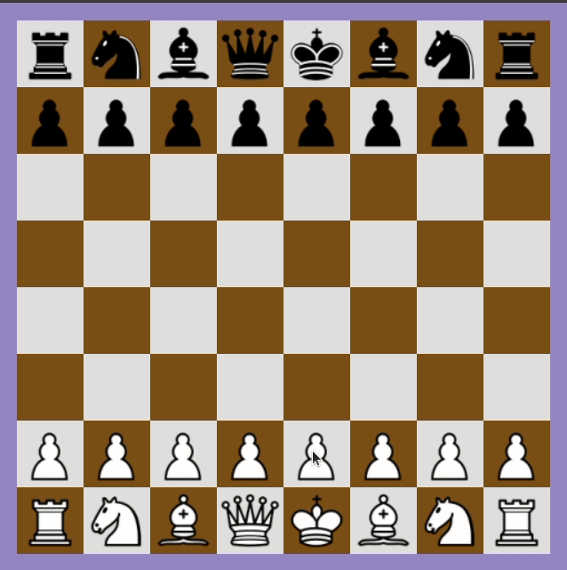

## Chess

This is an implementation of the game of [Chess](https://en.wikipedia.org/wiki/Chess) using C and the OpenGL framework.

The project was made to demonstrate the skills required to learn a programming language and use external libraries/APIs/etc as part of my course UE20CS151 (Problem Solving with C).

Try it out! You must install required OpenGL libraries if you do not have them already and link them correctly. Tested on both Windows and Linux but the make file only works for Windows.

```
git clone https://github.com/a-r-r-o-w/Chess
cd Chess
make -f build.mk
```


